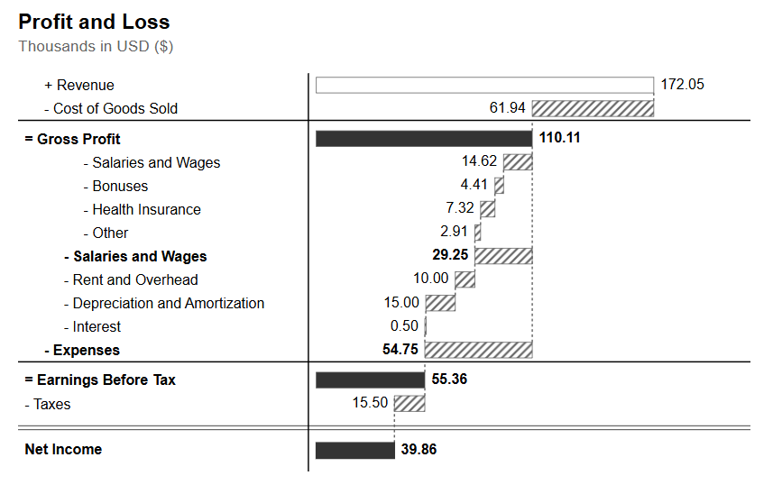

# EdwardCharles.WaterfallSVG

[](https://www.linkedin.com/in/edward-charles-085025b1/)
[](https://www.youtube.com/@DropMaterializedView)

Generate SVG waterfall charts for P&L visualization in Power BI.



## Attribution

Based on [IBCS® Chart Template C12: Vertical waterfalls](https://www.ibcs.com/resource/chart-template-12/)  
© 2024 IBCS Association | [www.ibcs.com](https://www.ibcs.com) with adaptations by Edward Charles.  
Licensed under [CC BY-SA 4.0 International](http://creativecommons.org/licenses/by-sa/4.0/legalcode).

## Usage

```dax
Image URL = EdwardCharles.WaterfallSVG.WaterfallChart(
    WaterfallLayout,
    WaterfallLayout[Key],
    WaterfallLayout[Parent],
    WaterfallLayout[Name],
    WaterfallLayout[Type],
    WaterfallLayout[Sort],
    WaterfallLayout[Depth],
    WaterfallLayout[IsLeaf],
    WaterfallLayout[Path],
    WaterfallLayout[Value],
    WaterfallLayout[Sign],
    200000,
    "2025 Profit & Loss",
    "USD ($)"
)
```

## Parameters

| Parameter | Type | Description |
|-----------|------|-------------|
| `_dataTable` | TABLE | Source table expression |
| `_keyCol` | COLUMN | Unique identifier (Integer) |
| `_parentCol` | COLUMN | Parent key (Integer) |
| `_nameCol` | COLUMN | Display name (String) |
| `_typeCol` | COLUMN | Row type ("Expense", "Income", "Subtotal") |
| `_sortCol` | COLUMN | Sort order (Integer) |
| `_depthCol` | COLUMN | Hierarchy depth (Integer) |
| `_isLeafCol` | COLUMN | Leaf status (Boolean) |
| `_pathCol` | COLUMN | Hierarchy path (String) |
| `_valueCol` | COLUMN | Value (Decimal) |
| `_signCol` | COLUMN | Sign multiplier (-1, 1) |
| `_maxValue` | INTEGER | Scale maximum for bar width |
| `_Title` | STRING | Main chart title |
| `_Subtitle` | STRING | Subtitle text |

## Model Independence

This function is **Model Independent**. It does not depend on specific table or column names in your data model. You can use any table structure by mapping your columns to the function parameters.

## Example Table Schema

The following schema is used in the examples below, but your table can use different column names.

| Column | Type | Description |
|--------|------|-------------|
| Key | INTEGER | Unique account identifier |
| Parent | INTEGER | Parent account key (BLANK for root) |
| Name | STRING | Display name |
| Type | STRING | "Expense", "Income", or "Subtotal" |
| Sort | INTEGER | Row ordering (ascending) |
| Depth | INTEGER | Hierarchy depth (1 = root) |
| IsLeaf | BOOLEAN | TRUE if no children |
| Path | STRING | DAX PATH() result |
| Value | DECIMAL | Raw value |
| Sign | INTEGER | +1 or -1 (calculated from AccountType) |

> **Note**: The UDF calculates `SignedValue = Value × Sign` internally.

## Example Implementation: Creating a Layout Table

The following example demonstrates how to create a layout table using `DATATABLE` and calculated columns. This is just one way to provide data to the function.

### Example Step 1: Base Data Table

```dax
WaterfallLayout = 
DATATABLE(
    "Key", INTEGER,
    "Parent", INTEGER,
    "Name", STRING,
    "Type", STRING,
    "Value", DECIMAL,
    "Sort", INTEGER,
    {
        {1, BLANK(), "Gross Profit", "subtotal", BLANK(), 3},
        {2, 1, "Revenue", "Income", 172052, 1}, 
        {3, 1, "Cost of Goods Sold", "Expense", 61939, 2},
        {5, 4, "Salaries and Wages", "Expense", 14615, 4},
        {6, 4, "Bonuses", "Expense", 4406, 5},
        {7, 4, "Health Insurance", "Expense", 7318, 6},
        {8, 4, "Other", "Expense", 2910, 7},
        {4, 9, "Salaries and Wages", "subtotal", BLANK(), 8},
        {10, 9, "Rent and Overhead", "Expense", 10000, 9},
        {11, 9, "Depreciation and Amortization", "Expense", 15003, 10},
        {12, 9, "Interest", "Expense", 500, 11},
        {9, 13,"Expenses", "subtotal", BLANK(), 12},
        {13, BLANK(),"Earnings Before Tax", "subtotal", BLANK(), 13},
        {14, BLANK(),"Taxes", "Expense", 15501, 14}
    }
)
```

### Example Step 2: Add Calculated Columns

```dax
// Path: Hierarchy path using DAX PATH function
Path = PATH(WaterfallLayout[Key], WaterfallLayout[Parent])

// Depth: Hierarchy level
Depth = PATHLENGTH(WaterfallLayout[Path])

// IsLeaf: TRUE if no children exist
IsLeaf = NOT(
    CALCULATE(
        COUNTROWS(WaterfallLayout), 
        FILTER(ALL(WaterfallLayout), WaterfallLayout[Parent] = EARLIER(WaterfallLayout[Key]))
    ) > 0
)

// Sign: -1 for Expenses, +1 for everything else
Sign = IF(WaterfallLayout[Type] IN {"Expense"}, -1, 1)
```

### Example Step 3: Call the UDF

Pass the table and explicit column references. This ensures the function is model-independent and works with any column naming convention.

```dax
WaterfallChart = EdwardCharles.WaterfallSVG.WaterfallChart(
    WaterfallLayout,
    WaterfallLayout[Key],
    WaterfallLayout[Parent],
    WaterfallLayout[Name],
    WaterfallLayout[Type],
    WaterfallLayout[Sort],
    WaterfallLayout[Depth],
    WaterfallLayout[IsLeaf],
    WaterfallLayout[Path],
    WaterfallLayout[Value],
    WaterfallLayout[Sign],
    200000,
    "2025 Profit & Loss",
    "USD ($)"
)
```

## Output

Returns an SVG data URI string for use in Power BI Image visual.

## License

This work is licensed under [CC BY-SA 4.0 International](http://creativecommons.org/licenses/by-sa/4.0/).

